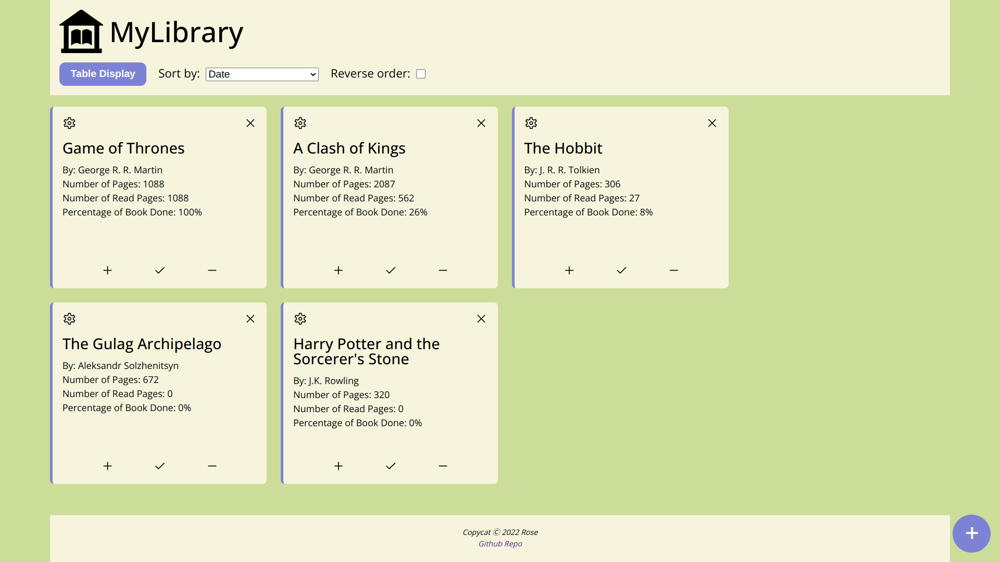
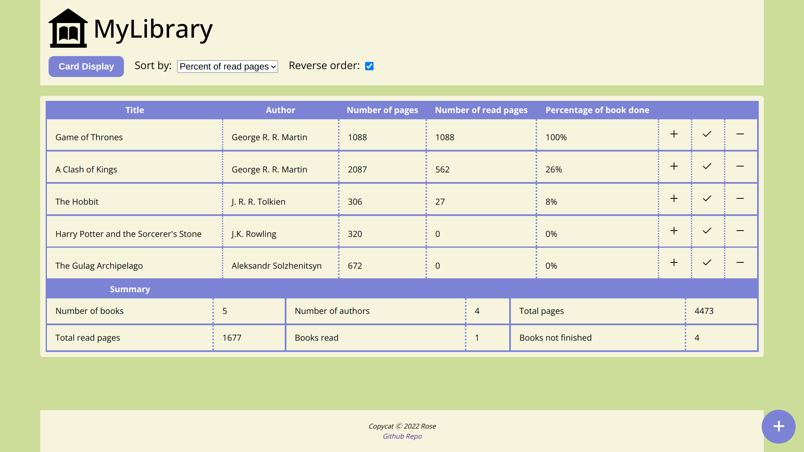
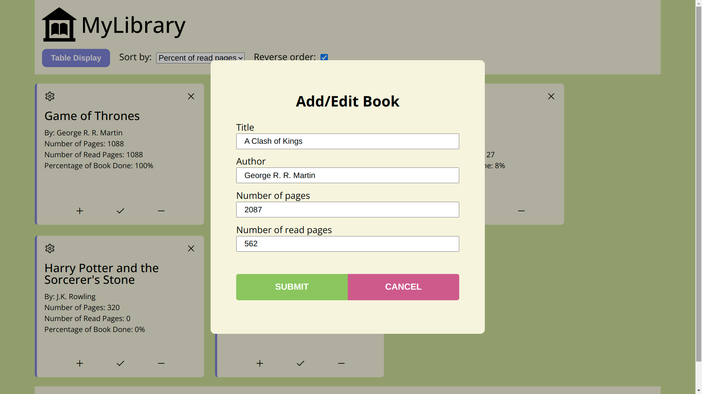

# MyLibrary
[Link to live demo!](https://rosendo-martinez.github.io/library/) 
&ensp;
Webpage Functionality:
- Validate form w/ HTML and JS
- Add, edit, and delete books
- Displays books in a card style or as a table
- Easily and quickly increment/decrement the number of read pages
- Sorts array of book objects by author, title, date added, and percentage of pages read
# Screenshots
&ensp;

&ensp;

&ensp;
